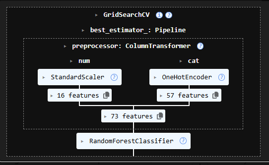
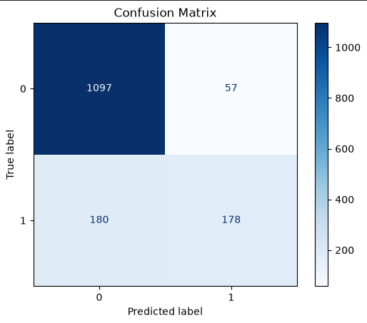
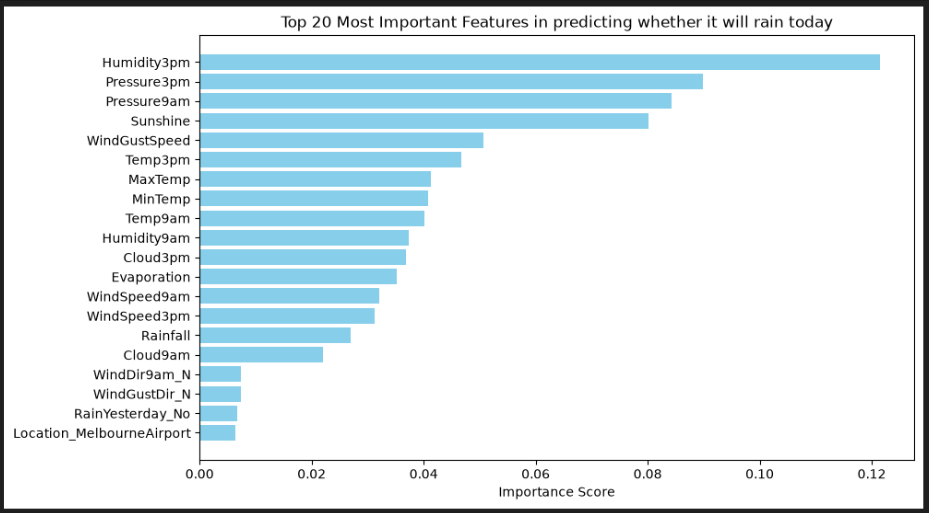

# 🌧 Rainfall Prediction Classifier


---

# 📌 Project Overview

This project builds a Machine Learning model to predict rainfall using historical Australian weather observations.

The project demonstrates an end-to-end machine learning workflow including:

- Data Cleaning
- Feature Engineering
- Data Preprocessing
- Exploratory Data Analysis (EDA)
- Pipeline Construction
- Hyperparameter Tuning using GridSearchCV
- Random Forest Classification
- Logistic Regression
- Model Evaluation
- Feature Importance Analysis

---

# 🎯 Objective

To accurately predict whether it will rain based on weather observations using supervised machine learning algorithms.

---

# 📊 Dataset

Dataset Used:

Australian Weather Dataset

Source:

IBM Skills Network

The dataset contains weather observations including:

- Temperature
- Humidity
- Pressure
- Wind Direction
- Wind Speed
- Rainfall
- Sunshine
- Cloud Cover
- Season

Target Variable:

RainToday

---

# 🛠 Technologies Used

- Python
- Pandas
- NumPy
- Matplotlib
- Seaborn
- Scikit-Learn
- Jupyter Notebook

---

# 🤖 Machine Learning Models

- Random Forest Classifier
- Logistic Regression

---

# ⚙ Machine Learning Workflow

- Data Cleaning
- Missing Value Handling
- Feature Engineering
- Train-Test Split
- Data Standardization
- One-Hot Encoding
- Pipeline Construction
- Hyperparameter Optimization
- Model Training
- Model Evaluation
- Feature Importance Analysis

---

# 📈 Evaluation Metrics

---

# 📷 Project Visualizations

## 🔄 Machine Learning Pipeline



---

## 📊 Random Forest Confusion Matrix



---

## 📈 Feature Importance



---

The models were evaluated using:

- Accuracy
- Precision
- Recall
- F1 Score
- Confusion Matrix
- Feature Importance

---

# 📂 Repository Structure

```
Rainfall-Prediction-Classifier/

│

├── Rainfall_Prediction_Classifier.ipynb

├── README.md
```

---

# 🚀 How to Run

1. Clone the repository.

2. Install dependencies.

3. Open the notebook.

4. Run all notebook cells.

---

# 📚 Learning Outcomes

This project demonstrates practical understanding of:

- Data preprocessing
- Feature engineering
- Machine learning pipelines
- Hyperparameter tuning
- Classification models
- Model evaluation
- Feature importance interpretation

---

# 👨‍💻 Author

Muhammad Hamza

AI & Machine Learning Student

Pakistan
